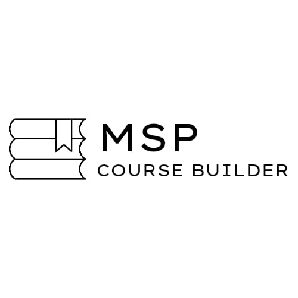
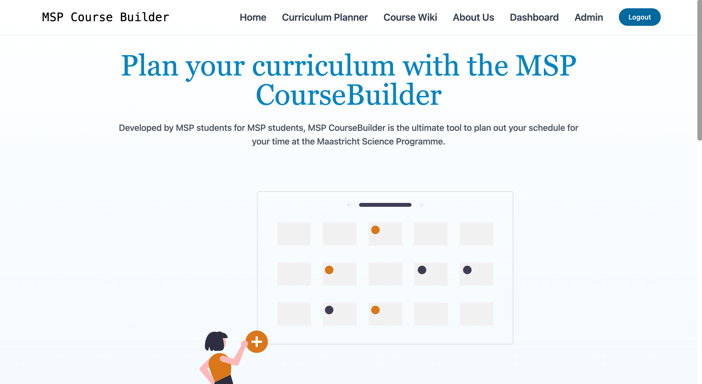

# MSPCourseBuilder

<!-- PROJECT LOGO -->

<div align ="center">
   
</div>

<!-- TABLE OF CONTENTS -->
<details>
  <summary>Table of Contents</summary>
  <ol>
    <li>
      <a href="#Description">About The Project</a>
      <ul>
        <li><a href="#built-with">Built With</a></li>
        <li><a href="#Installation">Installation</a></li>
      </ul>
    </li>
    <li><a href="#contributing">Contribuiting</a></li>
    <li><a href="#authors">Auhtors</a></li>
    <li><a href="#contac">Contact</a></li>
  </ol>
</details>

## Description
<div align ="center">

 </img>

Developed by MSP students for MSP students, MSP CourseBuilder is the ultimate tool to plan out your schedule for your time at the Maastricht Science Programme. This website was created in the context of a research project. 

</div>
 

### Built With

Project created with:

* [Vue.js 3.2.37](https://vuejs.org/)
* [Supabase](https://supabase.com/)
* [Tailwind 3.1.4](https://tailwindcss.com/)

### Installation

1. Clone the repo
   ```sh
   git clone https://github.com/gabeha/msp-web.git
   ```
2. Install NPM packages
   ```sh
   npm install
   ```

## Authors

We are 9 passionate students (Gabriel, Elizaveta, Sanne, Zoé, Kelly, Jens, Anton, Akiya, Mehaa) who want to make a difference within the MSP community. To learn more about the team, head over the [about us page](https://mspcoursebuilder.com/about) on the website.


## Contact

Your Name - 

Project Link: [https://github.com/gabeha/msp-web.git](https://github.com/gabeha/msp-web.git)

Website Link: [MSPCourseBuilder](https://mspcoursebuilder.com/)

